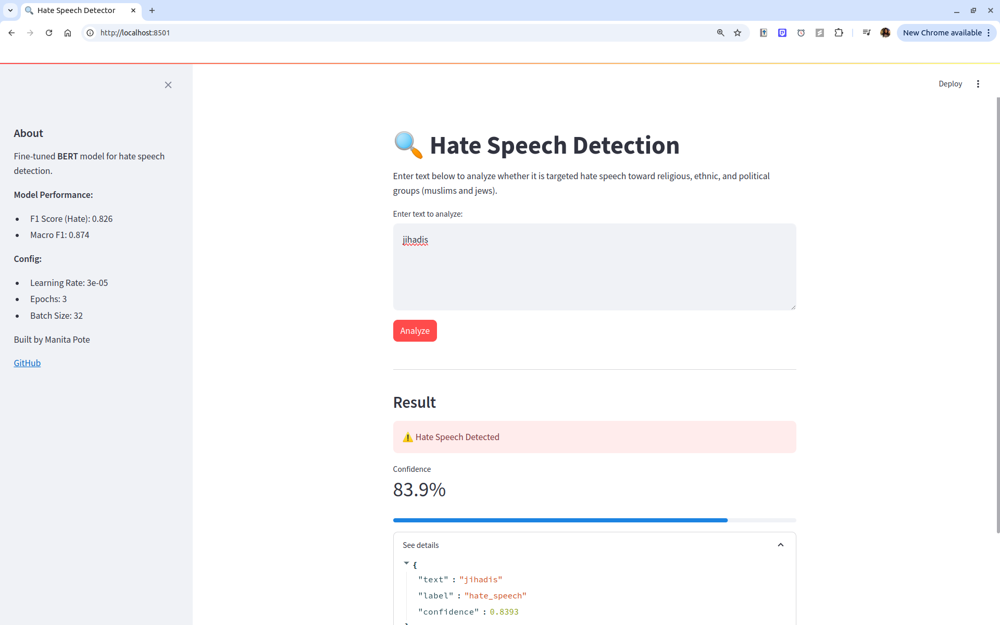

# Hate Speech Detection with BERT

A fine-tuned BERT model for detecting hate speech in tweets, with a FastAPI backend and Streamlit frontend for real-time inference.



---

## Overview

This project fine-tunes `bert-base-uncased` on a Twitter hate speech dataset to classify tweets as hate speech or not. It includes a full training pipeline with hyperparameter search, a REST API for serving predictions, and a web interface for interactive use.

**Model Performance (Best Config):**

| Metric | Score |
|---|---|
| F1 Score (Hate Speech) | 0.826 |
| Macro F1 | 0.874 |
| Test Loss | 0.379 |

**Best Hyperparameters:**

| Parameter | Value |
|---|---|
| Learning Rate | 3e-05 |
| Epochs | 3 |
| Batch Size | 32 |

---

## Dataset

- **Source:** Waseem & Hovy (2016) — Twitter hate speech dataset
- **Training set:** 14,143 tweets (71.5% not hate speech, 28.5% hate speech)
- **Labels:** 0 = not hate speech, 1 = hate speech
- **Focus:** Targeted hate speech directed at minority groups and communities, including religious, ethnic, and political groups. This dataset specifically captures hate speech aimed at identifiable groups rather than general personal insults.
- **Class imbalance handled via:** Balanced class weights in CrossEntropyLoss

**What counts as hate speech in this dataset:**
Tweets containing targeted attacks, slurs, or dehumanizing language directed at a specific group based on religion, ethnicity, nationality, gender, or political identity. General personal insults without group targeting are labeled as not hate speech.

**Citation:**

Waseem, Z., & Hovy, D. (2016). Hateful Symbols or Hateful People? Predictive Features for Hate Speech Detection on Twitter. In *Proceedings of the NAACL Student Research Workshop* (pp. 88–93). Association for Computational Linguistics, San Diego, California. http://www.aclweb.org/anthology/N16-2013

**BibTeX:**
```bibtex
@InProceedings{waseem-hovy:2016:N16-2,
  author    = {Waseem, Zeerak  and  Hovy, Dirk},
  title     = {Hateful Symbols or Hateful People? Predictive Features for Hate Speech Detection on Twitter},
  booktitle = {Proceedings of the NAACL Student Research Workshop},
  month     = {June},
  year      = {2016},
  address   = {San Diego, California},
  publisher = {Association for Computational Linguistics},
  pages     = {88--93},
  url       = {http://www.aclweb.org/anthology/N16-2013}
}
```

---

## Project Structure

```
bert_hatespeech/
├── app.py                        # FastAPI backend
├── streamlit_app.py              # Streamlit frontend
├── src/model.py                  # Model, optimizer, scheduler, loss setup
├── src/dataset.py                # Tokenizes text and returns input tensors for BERT.
├── src/metrics.py                # Metrics to calculate
├── src/trainer.py                # Training and evaluation loop
├── src/utils.py                  # Utility functions
├── search/grid_search.py         # Grid search across model parameters
├── search.py                     # Entry point for grid search
├── train.py                      # Entry point for training loop for one set of hyper parameters
├── config/config.py              # Hyperparameters and settings
├── requirements.txt              # Dependencies
├── data/
│   ├── train.csv                 # Training data
│   └── test.csv             # Annotator evaluation set
└── outputs/
    └── bert_hatespeech/
        └── search_20260412_182502/
            └── best_model/       # Saved model weights
                ├── model.safetensors
                ├── config.json
                ├── tokenizer_config.json
                ├── vocab.txt
                └── special_tokens_map.json
```

---

## Model Architecture

- **Base model:** `bert-base-uncased` (HuggingFace Transformers)
- **Task:** Binary sequence classification
- **Optimizer:** AdamW with weight decay (bias and LayerNorm excluded)
- **Scheduler:** Linear warmup + linear decay
- **Loss:** CrossEntropyLoss with balanced class weights
- **Dropout:** Applied to both hidden states and attention weights

---

## Training Pipeline

**Stage 1: Hyperparameter Search**
Grid search across learning rates (1e-05, 2e-05, 3e-05, 5e-05) and batch sizes at epoch 3.

**Stage 2: Refinement**
Best learning rate (3e-05) tested across epochs (2, 3, 4) and batch sizes (16, 32).

**Key finding:** More than 3 epochs leads to overfitting, train loss drops to 0.067 while test loss jumps to 0.559.

---

## Setup and Installation

**1. Clone the repository**

```bash
git clone https://github.com/manitapote/llm-projects/bert_hatespeech
cd bert_hatespeech
```

**2. Create a conda environment**

```bash
conda create -n bert_app python=3.10 -y
conda activate bert_app
```

**3. Install dependencies**

```bash
pip install -r requirements.txt
```

**requirements.txt:**
```
fastapi==0.111.0
uvicorn==0.30.0
transformers==4.40.0
torch==2.3.0
pydantic==2.7.0
numpy==1.26.4
streamlit==1.35.0
starlette==0.37.2
requests==2.32.0
pandas==2.2.0
scikit-learn
```

---

## Running Locally

**Step 1: Start the FastAPI backend:**

```bash
uvicorn app:app --host 0.0.0.0 --port 8000
```

**Step 2: Start the Streamlit frontend (new terminal):**

```bash
streamlit run streamlit_app.py --server.port 8501
```

**Step 3: Open your browser:**

```
http://localhost:8501
```

---

## Running on a Remote Server (SSH Tunnel)

If your model runs on a remote HPC cluster, tunnel the ports to your local machine:

**Step 1: Start FastAPI and Streamlit on the remote server:**

```bash
# Terminal 1 — FastAPI
uvicorn app:app --host 0.0.0.0 --port 8000

# Terminal 2 — Streamlit
streamlit run streamlit_app.py --server.port 8501
```

**Step 2: On your local machine, set up the SSH tunnel:**

```bash
ssh -J your_user@gateway.server.edu \
    -L 8080:localhost:8000 \
    -L 8501:localhost:8501 \
    your_user@compute_node.server.edu
```

**Step 3: Open your browser:**

```
http://localhost:8501
```

---

## API Usage

The FastAPI backend exposes a `/predict` endpoint:

**Request:**
```bash
curl -X POST "http://localhost:8000/predict" \
     -H "Content-Type: application/json" \
     -d '{"text": "your text here"}'
```

**Response:**
```json
{
  "text": "your text here",
  "label": "not_hate_speech",
  "confidence": 0.9958
}
```

**Interactive API docs:**
```
http://localhost:8000/docs
```

---

## Results

**Hyperparameter search results:**

| Learning Rate | Epochs | Batch Size | Test F1 (Hate) | Test Loss |
|---|---|---|---|---|
| 1e-05 | 3 | 32 | 0.784 | 0.362 |
| 2e-05 | 3 | 32 | 0.816 | 0.353 |
| **3e-05** | **3** | **32** | **0.826** | **0.379** |
| 5e-05 | 3 | 32 | 0.823 | 0.388 |


**Key observations:**
- Learning rate 3e-05 consistently outperforms others
- 3 epochs is optimal, epoch 4 shows clear overfitting (train loss 0.067, test loss 0.559)
- Batch size 32 marginally outperforms batch size 16
- Model has higher recall than precision (catches most hate speech but flags some false positives)

---

## Limitations

- Trained on Twitter data, may not generalize to other platforms
- Focuses on targeted group-based hate speech (religious, ethnic, political), general insults are classified as not hate speech by design
- No GPU inference optimization, for production use, consider ONNX export or TorchScript

---

## Author

**Manita Pote**
- [GitHub](https://github.com/manitapote)
- [LinkedIn](https://www.linkedin.com/in/manitapote)
- [Google Scholar](https://scholar.google.com/citations?user=ukS-vPcAAAAJ)

---

## License

MIT License